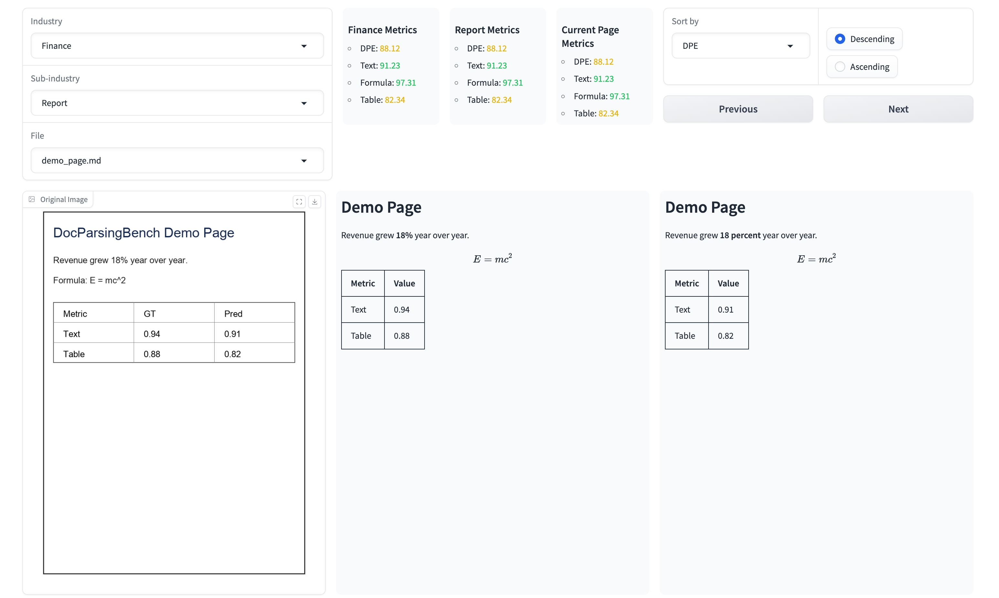
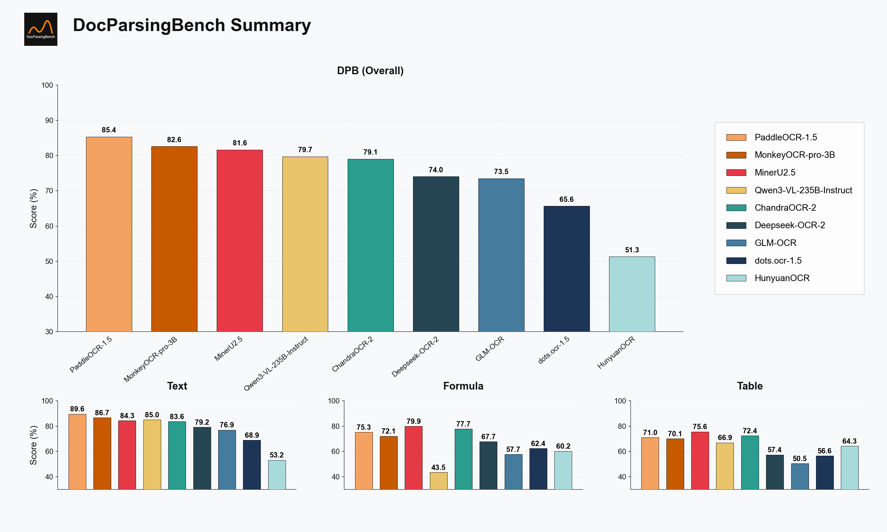
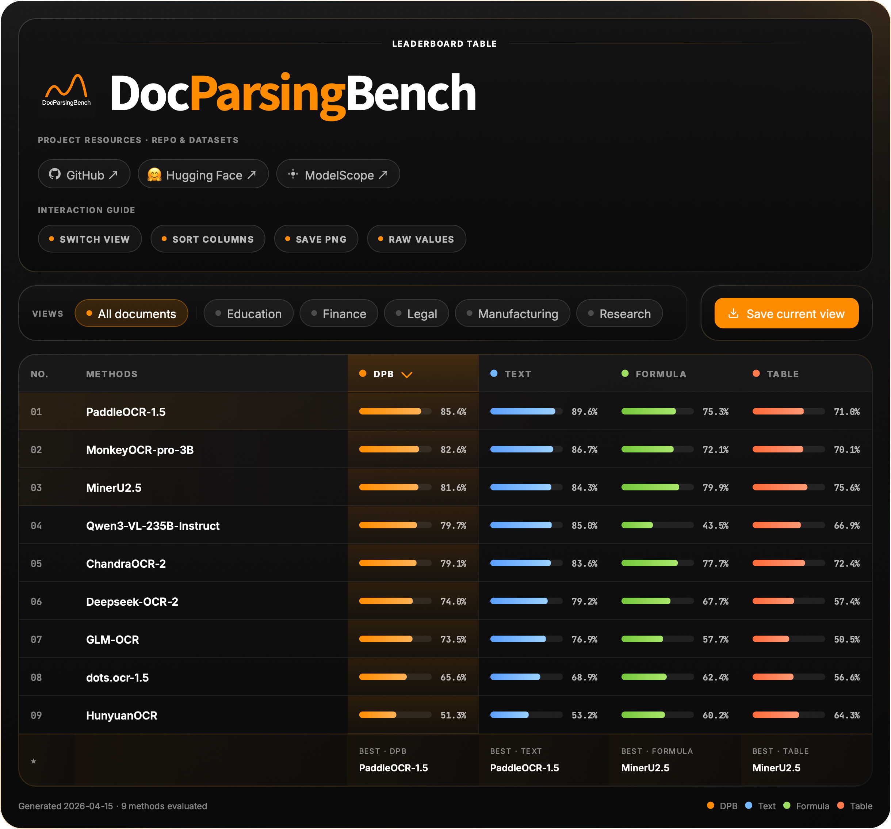

<div align="center" xmlns="http://www.w3.org/1999/html">
<p align="center">
  
</p>

[![HuggingFace](https://img.shields.io/badge/Dataset_on_HuggingFace-yellow.svg?logo=data:image/png;base64,iVBORw0KGgoAAAANSUhEUgAAAF8AAABYCAMAAACkl9t/AAAAk1BMVEVHcEz/nQv/nQv/nQr/nQv/nQr/nQv/nQv/nQr/wRf/txT/pg7/yRr/rBD/zRz/ngv/oAz/zhz/nwv/txT/ngv/0B3+zBz/nQv/0h7/wxn/vRb/thXkuiT/rxH/pxD/ogzcqyf/nQvTlSz/czCxky7/SjifdjT/Mj3+Mj3wMj15aTnDNz+DSD9RTUBsP0FRO0Q6O0WyIxEIAAAAGHRSTlMADB8zSWF3krDDw8TJ1NbX5efv8ff9/fxKDJ9uAAAGKklEQVR42u2Z63qjOAyGC4RwCOfB2JAGqrSb2WnTw/1f3UaWcSGYNKTdf/P+mOkTrE+yJBulvfvLT2A5ruenaVHyIks33npl/6C4s/ZLAM45SOi/1FtZPyFur1OYofBX3w7d54Bxm+E8db+nDr12ttmESZ4zludJEG5S7TO72YPlKZFyE+YCYUJTBZsMiNS5Sd7NlDmKM2Eg2JQg8awbglfqgbhArjxkS7dgp2RH6hc9AMLdZYUtZN5DJr4molC8BfKrEkPKEnEVjLbgW1fLy77ZVOJagoIcLIl+IxaQZGjiX597HopF5CkaXVMDO9Pyix3AFV3kw4lQLCbHuMovz8FallbcQIJ5Ta0vks9RnolbCK84BtjKRS5uA43hYoZcOBGIG2Epbv6CvFVQ8m8loh66WNySsnN7htL58LNp+NXT8/PhXiBXPMjLSxtwp8W9f/1AngRierBkA+kk/IpUSOeKByzn8y3kAAAfh//0oXgV4roHm/kz4E2z//zRc3/lgwBzbM2mJxQEa5pqgX7d1L0htrhx7LKxOZlKbwcAWyEOWqYSI8YPtgDQVjpB5nvaHaSnBaQSD6hweDi8PosxD6/PT09YY3xQA7LTCTKfYX+QHpA0GCcqmEHvr/cyfKQTEuwgbs2kPxJEB0iNjfJcCTPyocx+A0griHSmADiC91oNGVwJ69RudYe65vJmoqfpul0lrqXadW0jFKH5BKwAeCq+Den7s+3zfRJzA61/Uj/9H/VzLKTx9jFPPdXeeP+L7WEvDLAKAIoF8bPTKT0+TM7W8ePj3Rz/Yn3kOAp2f1Kf0Weony7pn/cPydvhQYV+eFOfmOu7VB/ViPe34/EN3RFHY/yRuT8ddCtMPH/McBAT5s+vRde/gf2c/sPsjLK+m5IBQF5tO+h2tTlBGnP6693JdsvofjOPnnEHkh2TnV/X1fBl9S5zrwuwF8NFrAVJVwCAPTe8gaJlomqlp0pv4Pjn98tJ/t/fL++6unpR1YGC2n/KCoa0tTLoKiEeUPDl94nj+5/Tv3/eT5vBQ60X1S0oZr+IWRR8Ldhu7AlLjPISlJcO9vrFotky9SpzDequlwEir5beYAc0R7D9KS1DXva0jhYRDXoExPdc6yw5GShkZXe9QdO/uOvHofxjrV/TNS6iMJS+4TcSTgk9n5agJdBQbB//IfF/HpvPt3Tbi7b6I6K0R72p6ajryEJrENW2bbeVUGjfgoals4L443c7BEE4mJO2SpbRngxQrAKRudRzGQ8jVOL2qDVjjI8K1gc3TIJ5KiFZ1q+gdsARPB4NQS4AjwVSt72DSoXNyOWUrU5mQ9nRYyjp89Xo7oRI6Bga9QNT1mQ/ptaJq5T/7WcgAZywR/XlPGAUDdet3LE+qS0TI+g+aJU8MIqjo0Kx8Ly+maxLjJmjQ18rA0YCkxLQbUZP1WqdmyQGJLUm7VnQFqodmXSqmRrdVpqdzk5LvmvgtEcW8PMGdaS23EOWyDVbACZzUJPaqMbjDxpA3Qrgl0AikimGDbqmyT8P8NOYiqrldF8rX+YN7TopX4UoHuSCYY7cgX4gHwclQKl1zhx0THf+tCAUValzjI7Wg9EhptrkIcfIJjA94evOn8B2eHaVzvBrnl2ig0So6hvPaz0IGcOvTHvUIlE2+prqAxLSQxZlU2stql1NqCCLdIiIN/i1DBEHUoElM9dBravbiAnKqgpi4IBkw+utSPIoBijDXJipSVV7MpOEJUAc5Qmm3BnUN+w3hteEieYKfRZSIUcXKMVf0u5wD4EwsUNVvZOtUT7A2GkffHjByWpHqvRBYrTV72a6j8zZ6W0DTE86Hn04bmyWX3Ri9WH7ZU6Q7h+ZHo0nHUAcsQvVhXRDZHChwiyi/hnPuOsSEF6Exk3o6Y9DT1eZ+6cASXk2Y9k+6EOQMDGm6WBK10wOQJCBwren86cPPWUcRAnTVjGcU1LBgs9FURiX/e6479yZcLwCBmTxiawEwrOcleuu12t3tbLv/N4RLYIBhYexm7Fcn4OJcn0+zc+s8/VfPeddZHAGN6TT8eGczHdR/Gts1/MzDkThr23zqrVfAMFT33Nx1RJsx1k5zuWILLnG/vsH+Fv5D4NTVcp1Gzo8AAAAAElFTkSuQmCC&labelColor=white)](https://huggingface.co/datasets/SoMarkAI/DocParsingBench)
[![ModelScope](https://img.shields.io/badge/Dataset_on_ModelScope-purple?logo=data:image/svg+xml;base64,PHN2ZyB3aWR0aD0iMjIzIiBoZWlnaHQ9IjIwMCIgeG1sbnM9Imh0dHA6Ly93d3cudzMub3JnLzIwMDAvc3ZnIj4KCiA8Zz4KICA8dGl0bGU+TGF5ZXIgMTwvdGl0bGU+CiAgPHBhdGggaWQ9InN2Z18xNCIgZmlsbD0iIzYyNGFmZiIgZD0ibTAsODkuODRsMjUuNjUsMGwwLDI1LjY0OTk5bC0yNS42NSwwbDAsLTI1LjY0OTk5eiIvPgogIDxwYXRoIGlkPSJzdmdfMTUiIGZpbGw9IiM2MjRhZmYiIGQ9Im05OS4xNCwxMTUuNDlsMjUuNjUsMGwwLDI1LjY1bC0yNS42NSwwbDAsLTI1LjY1eiIvPgogIDxwYXRoIGlkPSJzdmdfMTYiIGZpbGw9IiM2MjRhZmYiIGQ9Im0xNzYuMDksMTQxLjE0bC0yNS42NDk5OSwwbDAsMjIuMTlsNDcuODQsMGwwLC00Ny44NGwtMjIuMTksMGwwLDI1LjY1eiIvPgogIDxwYXRoIGlkPSJzdmdfMTciIGZpbGw9IiMzNmNmZDEiIGQ9Im0xMjQuNzksODkuODRsMjUuNjUsMGwwLDI1LjY0OTk5bC0yNS42NSwwbDAsLTI1LjY0OTk5eiIvPgogIDxwYXRoIGlkPSJzdmdfMTgiIGZpbGw9IiMzNmNmZDEiIGQ9Im0wLDY0LjE5bDI1LjY1LDBsMCwyNS42NWwtMjUuNjUsMGwwLC0yNS42NXoiLz4KICA8cGF0aCBpZD0ic3ZnXzE5IiBmaWxsPSIjNjI0YWZmIiBkPSJtMTk4LjI4LDg5Ljg0bDI1LjY0OTk5LDBsMCwyNS42NDk5OWwtMjUuNjQ5OTksMGwwLC0yNS42NDk5OXoiLz4KICA8cGF0aCBpZD0ic3ZnXzIwIiBmaWxsPSIjMzZjZmQxIiBkPSJtMTk4LjI4LDY0LjE5bDI1LjY0OTk5LDBsMCwyNS42NWwtMjUuNjQ5OTksMGwwLC0yNS42NXoiLz4KICA8cGF0aCBpZD0ic3ZnXzIxIiBmaWxsPSIjNjI0YWZmIiBkPSJtMTUwLjQ0LDQybDAsMjIuMTlsMjUuNjQ5OTksMGwwLDI1LjY1bDIyLjE5LDBsMCwtNDcuODRsLTQ3Ljg0LDB6Ii8+CiAgPHBhdGggaWQ9InN2Z18yMiIgZmlsbD0iIzM2Y2ZkMSIgZD0ibTczLjQ5LDg5Ljg0bDI1LjY1LDBsMCwyNS42NDk5OWwtMjUuNjUsMGwwLC0yNS42NDk5OXoiLz4KICA8cGF0aCBpZD0ic3ZnXzIzIiBmaWxsPSIjNjI0YWZmIiBkPSJtNDcuODQsNjQuMTlsMjUuNjUsMGwwLC0yMi4xOWwtNDcuODQsMGwwLDQ3Ljg0bDIyLjE5LDBsMCwtMjUuNjV6Ii8+CiAgPHBhdGggaWQ9InN2Z18yNCIgZmlsbD0iIzYyNGFmZiIgZD0ibTQ3Ljg0LDExNS40OWwtMjIuMTksMGwwLDQ3Ljg0bDQ3Ljg0LDBsMCwtMjIuMTlsLTI1LjY1LDBsMCwtMjUuNjV6Ii8+CiA8L2c+Cjwvc3ZnPg==&labelColor=white)](https://modelscope.cn/datasets/SoMark/DocParsingBench)
[](https://www.python.org)


English | [中文](./README_zh.md)

</div>

---

## Why DocParsingBench?

DocParsingBench is an evaluation toolkit **purpose-built for intelligent document parsing products**. We open-source the evaluation dataset, complete evaluation methodology, and analysis tools so developers can compare document parsing models in a unified, reproducible, and diagnosable way.

- **Data from real production scenarios:** All evaluation data is collected from real business scenarios, covering five industries: finance, legal, scientific research, manufacturing, and education, with 14 types of complex production documents.
- **Open dataset and evaluation methodology:** DocParsingBench provides public data, a unified evaluation pipeline, and reproducible scoring, allowing different models to be compared with the same yardstick.
- **More complete visual analysis:** Built-in visualization tools help locate exactly where a model fails, and support score breakdowns by business scenario to identify which document types a model handles reliably.
- **Faster evaluation:** On the same model, OmniDocBench takes about 720s, OLMbench takes about 480s, while DocParsingBench takes only about 125s, making it better suited for frequent iteration and batch comparison.
- **Higher model compatibility:** DocParsingBench evaluates the final Markdown output end to end without relying on any specific intermediate format, so most document parsing models can be plugged into the benchmark.
- **More flexible scoring logic:** Segment matching and the Hungarian algorithm make the evaluation tolerant of multiple reasonable reading-order expressions, reducing false penalties caused by assuming a single canonical order.

> If this project helps you, please consider giving it a ⭐ Star in the top-right corner. Your support is a huge encouragement to the team.

## Latest Updates

**[2026.04.17]** [DocParsingBench](https://github.com/SoMarkAI/DocParsingBench) evaluation toolkit release. It will provide unified scoring for the three core elements of document parsing: **text, formula, and table**, along with **CLI batch evaluation, segment matching, visualization analysis, and leaderboard generation**. 📊

**[2026.03.09]** DocParsingBench dataset release. The first intelligent document parsing dataset built for real industry scenarios, covering finance, legal, scientific research, manufacturing, and education. Now available on [Hugging Face](https://huggingface.co/datasets/SoMarkAI/DocParsingBench)、[ModelScope](https://modelscope.cn/datasets/SoMark/DocParsingBench)！🔥🔥🔥

## Dataset

We systematically collected and annotated document samples from real business workflows, preserving real-world noise such as **scan artifacts, stamp occlusion, and blurry characters**. The dataset contains **1400 pages**, covering Chinese, English, and mixed Chinese-English documents; layouts include single-column, double-column, triple-column, and mixed layouts. Annotations use Markdown, and chemical structures follow the [SoMarkdown](https://github.com/SoMarkAI/SoMarkDown) specification, combining SMILES with LaTeX to ensure complete rendering.

| Industry | Typical Documents | Key Characteristics |
|-----------|----------|----------|
| **Finance** | Brokerage research reports, annual reports of listed companies, prospectuses | Multi-column tables, stamped scanned documents, complex table structures |
| **Legal** | Legal documents, contract clauses, industry standards | Standardized headers and footers, dense footnotes |
| **Scientific Research** | Academic papers, programming textbooks, patent full texts | Double-column/multi-column mixed layouts, many formulas, code blocks, chemical equations |
| **Manufacturing** | Operation SOPs, forms, invoices and receipts | Blurry scans, handwritten fields, QR/barcode interference |
| **Education** | English, chemistry, and mathematics textbooks | Chemical structures, reaction equations, multiple-choice questions, fill-in-the-blank questions |
| **Overall Coverage** | 1400 pages of real business documents | Chinese, English, and mixed Chinese-English; single-column, double-column, triple-column, and mixed layouts |

## Visual Analysis Tool

DocParsingBench provides a per-sample visual analysis interface that places the original page, ground-truth Markdown, predicted Markdown, and evaluation metrics in one view. Developers can filter results by industry, sub-industry, and sample to quickly locate errors across text, formulas, tables, and other document elements.

<div align="center">
  
</div>

## Metric Overview

Given two Markdown files (prediction and ground truth), DocParsingBench performs segment-level matching and scoring by category, and outputs both overall and per-category scores with reusable metric wrappers and visualization tools.

- Segment categories: `text (with inline formulas)`, `display_formula`, `table`, `image` (currently dropped in evaluation)
- Segmentation: text and display formulas are split by line boundaries; tables are bounded by `<table> ... </table>`
- Matching: Hungarian matching is applied within each category using configured matching metrics (`NED`, `CDM`, `TEDS`)
- Metric wrappers: `NED/CER`, `CDM`, `TEDS/TEDS-S`
- Overall metric: DPB (Document Parsing Benchmark), a weighted average with default weights `α=0.5, β=0.3, γ=0.2`

```math
\begin{aligned}
text\_score &= \alpha \cdot avg(1 - NED) + (1 - \alpha) \cdot avg(CDM) \\
display\_formula\_score &= avg(CDM) \\
table\_score &= avg(TEDS) \\
DPB &= \alpha \cdot text\_score + \beta \cdot display\_formula\_score + \gamma \cdot table\_score
\end{aligned}
```

## Evaluation Leaderboard

| **Rank** | **Methods**             | **DPB** | **Text** | **Formula** | **Table** |
| -------- | ----------------------- | ------- | -------- | ----------- | --------- |
| 1        | PaddleOCR-1.5           | 0.8535  | 0.8959   | 0.7527      | 0.7104    |
| 2        | MonkeyOCR-Pro-3B        | 0.8260  | 0.8669   | 0.7206      | 0.7014    |
| 3        | MinerU2.5               | 0.8164  | 0.8426   | 0.7993      | 0.7557    |
| 4        | Qwen3-VL-235B-Instruct  | 0.7971  | 0.8496   | 0.4355      | 0.6691    |
| 5        | ChandraOCR-2            | 0.7906  | 0.8361   | 0.7772      | 0.7242    |
| 6        | Deepseek-OCR-2          | 0.7403  | 0.7917   | 0.6775      | 0.5741    |
| 7        | GLM-OCR                 | 0.7348  | 0.7695   | 0.5773      | 0.5046    |
| 8        | dots.ocr-1.5            | 0.6564  | 0.6885   | 0.6236      | 0.5655    |
| 9        | HunyuanOCR              | 0.5128  | 0.5319   | 0.6018      | 0.6428    |

<div align="center">
  <p><strong>Summary Chart</strong></p>
  
</div>

<div align="center">
  <p><strong>Interactive Leaderboard</strong></p>
  
</div>

## Installation

- Requires Python 3.8+
- Dependencies are declared in `pyproject.toml`

```bash
git clone https://github.com/SoMarkAI/DocParsingBench.git
cd docparsingbench

pip install .

# For local development:
pip install -e .
```

## Configuration

Configuration is defined in YAML and maps 1:1 to the internal `Config` dataclass. A reference file is provided at `config.example.yaml`.

Key options:
- `chromedriver_path`: if unset or `null`, `fastcdm` uses its own default.
  - See the [FastCDM chromedriver installation guide](https://github.com/BinyangQiu/FastCDM/blob/main/docs/chromedriver_installation.md)
- `visualize`: whether to generate CDM visualization images during evaluation (effective only when `formula.metric: "CDM"`). Output images are saved in `<output>/cdm_vis/`.

### Local Development With fastcdm Source

To use local `fastcdm` source code instead of an installed package, set `FASTCDM_SRC` to the source root:

```bash
export FASTCDM_SRC=/path/to/fastcdm
```

You can add this line to `~/.zshrc` or `~/.bashrc` for persistence. If not set, the installed `fastcdm` package is used.

## Usage

### Evaluation

`dpb` is packaged as a CLI entrypoint and is equivalent to `python -m docparsingbench.cli`.

```bash
python -m dpb eval \
  --gt path/to/gt.md \
  --pred path/to/pred.md \
  --config config.yaml \
  --out result.json
```

If `--gt` and `--pred` are directories, matching filenames are evaluated in batch.

```bash
# gt_dir contains a.md, b.md, c.md ...
# pred_dir contains a.md, b.md, c.md ...
python -m dpb eval \
  --gt gt_dir/ \
  --pred pred_dir/ \
  --config config.yaml \
  --out result.json
```

After `eval`, the terminal prints a model-level one-line summary with `Model`, `Files`, `DPB`, `Text`, `Formula`, `Table`, `FormulaRenderFailures`, and `Output`.

### Segment Testing

```bash
python -m dpb segment \
  --in path/to/md \
  --out segments.json
```

### Visualization

```bash
dpb visualize \
  --labels path/to/labels.json \
  --img path/to/images_dir \
  --gt path/to/gt_markdowns_dir \
  --pred path/to/pred_markdowns_dir \
  --result path/to/model.result.json
```

- `labels.json` stores only sample-to-industry/sub-industry mappings. If `--labels` is omitted, it is auto-generated alongside `gt`.

### Summary Bar Chart (`summary-chart`)

```bash
dpb summary-chart \
  --labels path/to/labels.json \
  --results path/to/results_dir \
  --exclude-model-prefix deepseek_ocr \
  --y-min 30 \
  --y-max 100 \
  --output path/to/summary_chart.png
```

- Optional: repeat `--exclude-model-prefix` to hide model families by result filename prefix.
- Optional: set y-axis range via `--y-min` / `--y-max` (defaults: `30` / `100`).

Batch evaluation can auto-generate the chart when all conditions are met:
- `--gt` and `--pred` are both directories
- `summary_chart.enable: true` (default: `true`)
- `summary_chart.y_min` / `summary_chart.y_max` (defaults: `30` / `100`)
- `--labels` is omitted and can be auto-generated from `gt`

```bash
dpb eval \
  --gt data/gt/DocParsingBench/markdowns \
  --pred data/pred/some_model_md \
  --config config.yaml \
  --out data/results/some_model_md.result.json
```

### Interactive HTML Leaderboard (`leaderboard-html`)

Generates a single self-contained `.html` file with interactive sorting
and filtering. Open it in any browser or share it directly without a server.

```bash
dpb leaderboard-html \
  --labels path/to/labels.json \
  --results path/to/results_dir \
  --output leaderboard.html \
  --exclude-model-prefix deepseek_ocr   # optional, repeatable
```

- All data (All + per-industry views) is embedded inline as JSON
- Industry switch: `All / Education / Finance / Legal / Manufacturing / Research`
- Metrics and ranking in one table: `DPB / Text / Formula / Table`
- Default sort: DPB descending; click any column header to cycle desc/asc
- Hover a metric cell → cursor-following tooltip with the 4-decimal raw value
- **Save as image** button exports the current view as PNG via `html2canvas`
- Smooth bar-width transitions when switching industries or sort columns

## Metric Notes

- NED (Normalized Edit Distance): normalized edit distance computed after character-level normalization
- CER (Character Error Rate): edit distance divided by GT length
- CDM: formula matching metric based on `fastcdm`, returns F1/recall/precision (F1 is used by default)
- TEDS/TEDS-S: table tree-edit-distance-based similarity (`greater is better`); TEDS-S compares structure only
- Hungarian matching: one-to-one matching within each segment category; unmatched pairs are scored as 0 similarity

## DPB Calculation

- Text: `text_score = α * avg(1 - NED) + (1 - α) * avg(CDM)`
- Display formula: `avg(CDM)` (or NED depending on config)
- Table: `avg(TEDS)` (or TEDS-S)

`DPB = α * text_score + β * display_formula_score + γ * table_score`

Different domain presets (for example paper/finance/tech) can define different weight presets.

## Model Runner Scripts

The `scripts/` directory provides OCR model runner scaffolding with a unified pipeline:
scan image directory -> call model -> post-process -> output Markdown.

### Usage

```bash
# Deepseek-OCR example
python -m scripts.deepseek_ocr ./images ./output/deepseek_ocr_md
```

### Add a New Model

Inherit `BaseModelRunner` and implement `parse_md`:

```python
from scripts.base import BaseModelRunner

class MyModelRunner(BaseModelRunner):
    name = "my_model"

    def parse_md(self, img_path: str) -> str:
        # call model API / SDK / local inference and return markdown
        ...

    def postprocess(self, md: str) -> str:
        # optional: cleanup / formatting
        return md
```

The base class handles image scanning, tqdm progress display, resume behavior (skip existing outputs), and failure statistics.

### Implemented Models

| Script | Model | Status |
|------|------|------|
| `deepseek_ocr.py` | DeepSeek OCR | Implemented |
| `dots_ocr.py` | Dots OCR | Implemented |
| `glm_ocr.py` | GLM OCR | Implemented |
| `hunyuan_ocr.py` | Hunyuan OCR | Implemented |
| `mineru.py` | MinerU | Implemented |
| `monkey_ocr.py` | Monkey OCR Pro 3B | Implemented |
| `paddle.py` | PaddleOCR | Implemented |
| `qwen3_vl.py` | Qwen3-VL | Implemented |
| `chandra_ocr.py` | Chandra OCR | Implemented |

## Performance Evaluation Design

This project reserves hooks and a unified output schema for performance benchmarking. Real model invocation can be driven externally.

- In CLI `eval`, when `perf.enable=true`, it records:
  - segmentation time, matching time, each metric's time, and total time
  - document count and throughput (`docs/s`)
- Output is written to `perf` in `result.json`:
  - `phases`: timing by phase
  - `throughput`: document throughput
  - `notes`: external model invocation marker (empty by default or filled by upper layers)

Benchmark speed reporting should use evaluation-phase runtime + document throughput, excluding external model generation latency. External model latency should be recorded by upper-layer systems.

## WeChat Group


